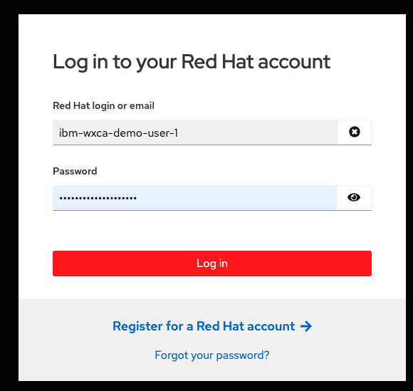
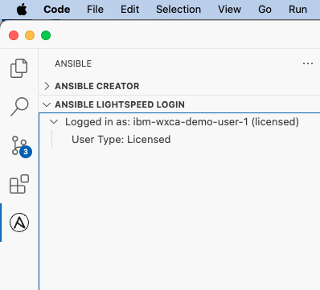
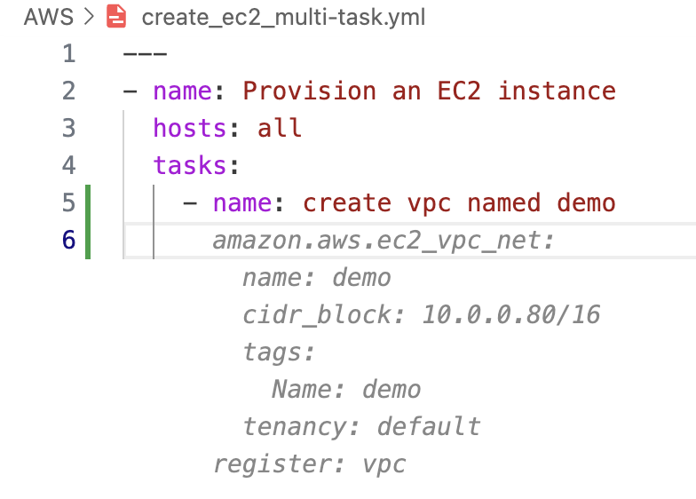

# IBM watsonx Code Assistant repository for Red Hat Ansible Lightspeed demo

<h2>This repository contains examples which you can use to test out the capabilities of IBM watsonx Code Assistant for Ansible Lightspeed.</h2>

With this VM demo you can test:
- Inferencing from natural language requests.
- Single-task and Multi-task content generation for Playbooks
- Code Similarity and transparency.

<h2>Getting started</h2>  

<h3>Logging into Ansible Extension on VS Code</h3>

1. The Lightspeed service only works on VS Code with an active Red Hat Ansible Automation Platform Subscription. Hence, you need to login to the Ansible Extension with a Red Hat ID in order to enable Lightspeed service.
2. To login, go to the Ansible icon on your left panel and click "Connect" under Ansible Lightspeed Login. Upon clicking, "Allow" the link to open in the browser.
    
    

    <!--  -->
3. In this VM setup, we have saved an active Red Hat ID in the Firefox web-browser.

    

4. Once you have logged in successfully, and back on VS Code, you can confirm the Red Hat License by clicking on the Ansible icon on the left panel

    

<h3>Setup your environment</h3>

1. Update your working directory (`/home/techzone/Documents/ansible-wca-demo-kit`) with the latest examples: Perform `git fetch` & `git pull` on the VS Code terminal.
2. Each example has its own README.md to help give context. You can follow the instructions within the README.md or the individual YAML files.

    

<h3>Trying out examples</h3>

We have uploaded few basic scenarios which gives you an idea on how watsonx Code Assistant can interpret the natural lanuguage in prompts and further by uncommenting and hitting `Enter`, you can get content suggestions. To accept the content suggested, hit `Tab`.

<h3>Testing Single-task and Mutli-task Playbook content generation</h3>

<h4>Traditional Playbook writing experience</h4>

In your Playbook writing experience, you usally tend to write it in a step-by-step approach. You write the single-tasks one after the other. 
<!--  -->

<h4>Speed up Playbook writing with Single-task & Multi-task content generation</h4>

- The Generative AI capabilities of watsonx Code Assistant will enable you complete your IT Automation in Playbook faster.
- Simply provide your intent in plain English language and watsonx Code Assistant will return the content suggestion for it.
- In the below example we show single-task prompt and the recommendation by watsonx Code Assistant:
<!--  -->
<!--  -->

- Now, take it to the next level by giving all the IT Automation instructions/tasks together. Type in all the individual tasks below the `tasks` parameter by separating it with an `&`. You should comment the line in order for watsonx Code Assistant to interpret the prompt.
- In the below example we show multi-task prompt and the recommendation by watsonx Code Assistant:
<!--  -->

This comment line now acts as a prompt to the watsonx Code Assistant.

<h3>Step 3: Going beyond examples</h3>

- Now that you know how watsonx Code Assistant can interpret the prompts, you can start framing your IT Automations in a sentance and just hit `Enter`
- You can test your own scenarios by writing new playbooks and modifying the prompts the way you like it.

## FAQ

1. Who are the main audience for this demo setup? _ONLY IBM INTERNAL. IBM Sellers & IBM Client Engineering teams. To provision a VM go to: _https://techzone.ibm.com/collection/ibm-watson-x-code-assistant-for-ansible-lightspeed/environments_ and select "WCA for Ansible Essentials Plan: Visual Studio Desktop 1.3"
2. What is the purpose of this demo setup? _This technical content can help you get acquainted with watsonx Code Assistant's features and provide you an opportunity for a live demo to clients_
3. Even after logging into the VM, it asks me to re-authenticate. Which credentials to provide? _The same credentials you input to connect to the VM_

## Stay connected

Reach out to the watsonx Code Assistant team on the IBM internal slack channel on IBM Software workspace: 
- `#wca-ansible-techzone-support`: Use this slack channel to discuss/ask for support/feedback specifically on TechZone Demo.
- `#watsonx-code-assistant`: Use this slack channel to ask questions and get the latest updates around IBM watsonx Code Assistant.

## Thank You
_Thanks Pete Nuwayser, Craig Brandt for helping in curating these examples. Some examples _Forked from_ https://github.com/craig-br/lightspeed-demos_
